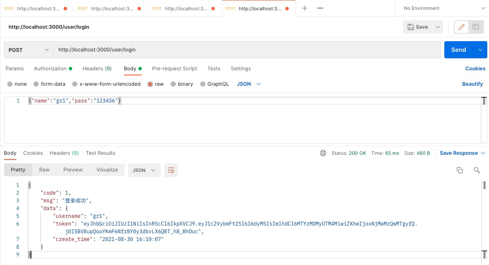
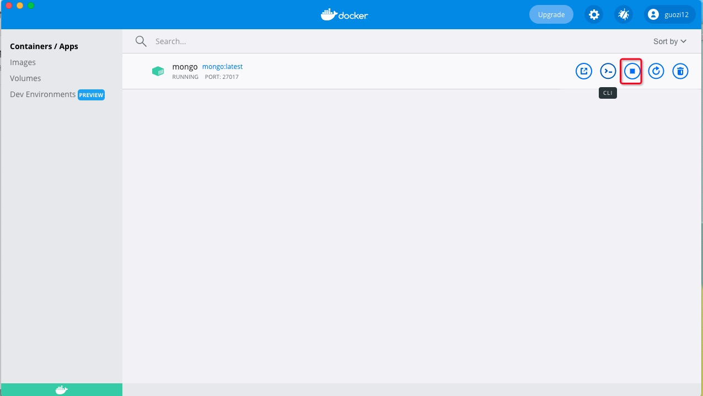
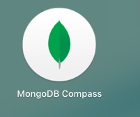
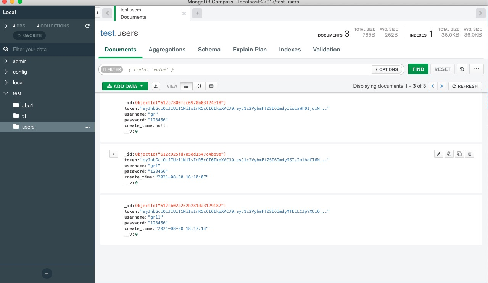

# node-artproject

美术项目后端工程

## 安装依赖 
 - npm install

## 运行
 - npm start
## 接口使用postman测试


## bilibili上不错的课程
 https://www.bilibili.com/video/BV1NM4y1K7kL

 ## 一、此项目参考文章
 - 搭建koa2脚手架： https://www.jianshu.com/p/4a458e14cb73
 - 官网地址： https://koajs.com/#introduction
 - 数据库连接 ：https://www.jianshu.com/p/a7b2fd7290be
https://blog.csdn.net/dreamjay1997/article/details/83901774

## 二、准备工作
 - 安装docker，拉取mongodb镜像,start运行（参考https://www.cnblogs.com/chocolatexll/p/13228141.html）

 

 - 安装mongodb可视化工具



connect（连接数据库）


（test是数据库，users、abc1、t1是集合也就是表）


## 三、项目搭建流程及数据库连接
 - 安装koa2项目生成器生成项目

``` javascript
  npm install -g koa-generator

  koa2 HelloKoa2 //自动生成项目

  npm install //安装依赖

  npm start //运行项目默认端口为3000 loalhost:3000

```
 - 安装mongodb和mongoose

 ```javascipt
 npm install mongodb --save
 npm install mongodb --save
 ```
 - mongodb连接（routes/index.js测试连接数据库是否成功,是否可以获取到数据）
 ```javascript
  // 引人mongoose依赖
const mongoose =require("mongoose");

// 创建数据库
const db_url='mongodb://localhost:27017/test';
//链接数据库

mongoose.connect(db_url,{ useNewUrlParser: true, useUnifiedTopology: true }, async (err, client) => {
  if(!err){
    console.log('数据库连接成功')
    const Schema1 = mongoose.Schema;
    const UserSchema1 = new Schema1({
        name:String
    })
    const User = mongoose.model('t1', UserSchema1)
    let user =await User.findOne({name:'guorong'}).exec()
    console.log(user)

  }
});

// 导出数据库
module.exports=mongoose;
 ```


